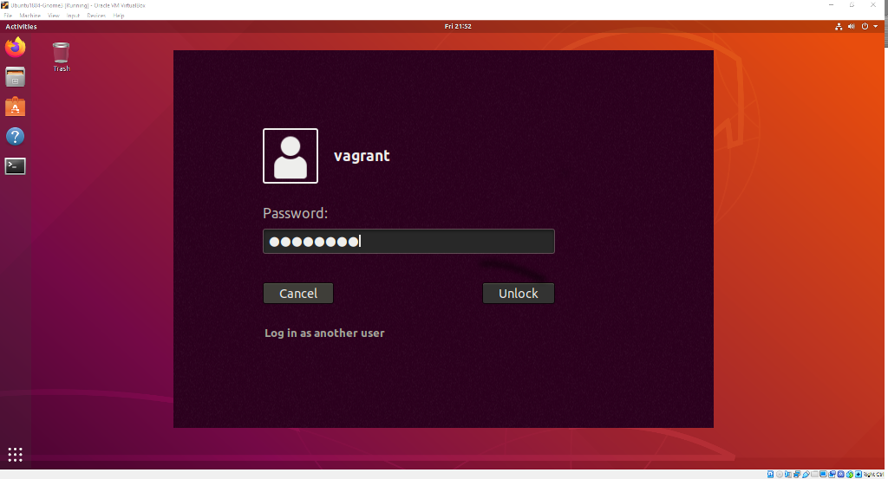
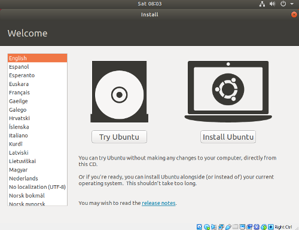
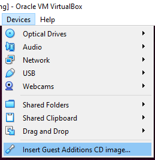
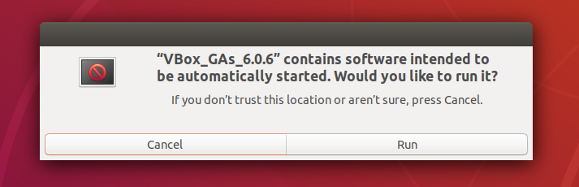
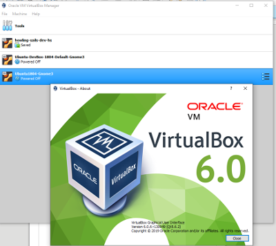
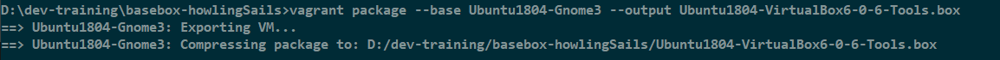

# vagrant-dev-ubuntu-18-04

A Vagrant configuration for getting a Ubuntu 18.04 UI desktop running in VirtualBox.
[GitHub/HowlingSails](https://github.com/howlingsails/vagrant-dev-ubuntu-18-04.git)

## Directions

1. Install Virtual Box [https://www.virtualbox.org/wiki/Downloads]
2. Install Vagrant [https://www.vagrantup.com/downloads.html]
3. Install git [https://git-scm.com/book/en/v2/Getting-Started-Installing-Git]
4. make a workspace director (D:\_dev) (~/-dev)
5. Start Virtual Box
6. Open a command prompt (windows) / terminal (mac)
7. Clone this repo into your workspace directory
8. Switch into this directory
9. Linux/Mac terminal run `vagrant up --debug &> vagrant.log`
10. Windows Powershell  `vagrant up --debug 2>&1 | Tee-Object -FilePath ".\vagrant.log"`
11. Watch vagrant run. This will take a long time as it downloads and creates a full development box.
12. Grap coffee and watch another Howling Sails vblogs :-)
13. One Completed you'll see "That's All Folks" message in the terminal.
14. Now switch to Virtual Box and login, User:vagrant Password: vagrant
15. Login
16. Open README.md on the box for following steps.



## Password

User and Password are both (vagrant/vagrant).

### TODO: After you get a working dev box

* *Change the password*
* All the configuration is for vagrant don't change users everything is installed for vagrant

### TODO: Get Script

* Download Script
* Configure Script
* Run Script

## Building Your own

* Create a new Virtual Box, Using the base Ubuntu like Ubuntu1804-Gnome3



*

1. user/password vagrant (You can change that when you have dev box deployed)
2. Enable Bridge Networking

``` html
     https://relativkreativ.at/articles/how-to-build-a-vagrant-base-box-from-a-virtualbox-vm
```

* Install Virtual Box Tools



* Select Run
  


# Set Up SSH Auth

* Log into box
* Open Terminal
* Install open-ssh-server and configure

``` bash
sudo apt upgrade
sudo apt install openssh-server
mkdir -m 0700 /home/vagrant/.ssh
wget --no-check-certificate https://raw.githubusercontent.com/mitchellh/vagrant/master/keys/vagrant.pub -O /home/vagrant/.ssh/authorized_keys
chmod 0600 /home/vagrant/.ssh/authorized_keys
```

* Edit sshd_config to allow vagrant to configure box

``` bash
 sudo nano /etc/ssh/sshd_config
```

* Uncomment  #AuthorizedKeysFile      .ssh/authorized_keys .ssh/authorized_keys2
* Find the line which reads #UseDNS yes and change it to UseDNS no.
* Save nano - ctrl-O - Press Enter to save same filename
* Quit nano - ctrl-x

``` bash
systemctl restart sshd.service
systemctl enable sshd.service
sudo apt-get install gcc make perl
mkdir -p /home/vagrant/.ssh
chmod 0700 /home/vagrant/.ssh
wget --no-check-certificate https://raw.github.com/hashicorp/vagrant/master/keys/vagrant.pub -O /home/vagrant/.ssh/authorized_keys
chmod 0600 /home/vagrant/.ssh/authorized_keys
chown -R vagrant /home/vagrant/.ssh
# Set up sudo
sudo echo %vagrant ALL=NOPASSWD:ALL > /etc/sudoers.d/vagrant
sudo chmod 0440 /etc/sudoers.d/vagrant
# Setup sudo to allow no-password sudo for "sudo"
sudo usermod -a -G sudo vagrant
```

## Package VirtualBox to Vagrant Image

* package file
  
``` bash
vagrant package --base Ubuntu1804-Gnome3 --output Ubuntu1804-VirtualBox6-0-6-Tools.box
```



* Make a base image from here, so you can retry your automation custom scripts then you need to upgrade to a new os.

``` bash
vagrant package --base Ubuntu1804-Gnome3 --output Ubuntu1804-VirtualBox6-0-6-Tools.box
```



* Add Box to Local Vagrant

``` bash
vagrant box add --name devHowlingSails Ubuntu1804-VirtualBox6-0-6-Tools.box --force
```

* You are ready to make a new development instance of your new machine

### Make New Instance of this new box

* Create a new Vagrant file
  
> Start with a Copy of the vagrant file in this repo and adjust names and configuration to  your liking

* Run Vagrant Up starting at step 9 at the top
